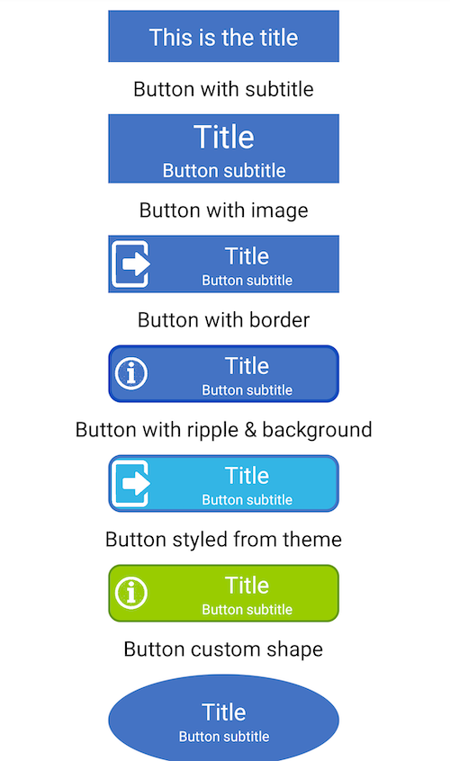
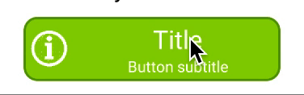

# Image Subtitle Button
The app has a custom module called Image Subtitle Button Lib, which is used across the main application.

Image-Subtitle Button has the following properties:

a) Button title - show/hide/change color/size\
b) Button subtitle - show/hide/change color/size\
c) Button image - show/hide/tint color/Image size\
d) Button ripple - color\
e) Button background color\
f) Button shape (rectange, circle, square, oval)\
g) Button border - width/color\
h) Button corner - radius

These attributes can be configured from layouts.xml

For example:
```
<com.rafsan.image_subtitlebuttonlib.ImageSubtitleButton
android:id="@+id/logoutBtn"
android:layout_width="250dp"
android:layout_height="50dp"
android:layout_marginBottom="50dp"
android:onClick="@{()->viewModel.logoutUser()}"
app:btn_backgroundColor="@color/light_blue"
app:btn_borderColor="@color/border_color"
app:btn_borderWidth="1dp"
app:btn_cornerRadius="10dp"
app:btn_image="@drawable/logout_icon"
app:btn_imageSize="40dp"
app:btn_imageTint="@color/white"
app:btn_imageVisible="true"
app:btn_rippleColor="@color/purple_700"
app:btn_subtitle="@string/end_session"
app:btn_subtitleColor="@color/white"
app:btn_title="@string/logout"
app:btn_titleColor="@color/white"/>
```

The attributes can also be configured from themes.xml

For example:
```
<com.rafsan.image_subtitlebuttonlib.ImageSubtitleButton
android:id="@+id/loginBtn"
style="?attr/button_style"
android:layout_width="200dp"
android:layout_height="50dp"
android:layout_marginTop="50dp"
android:onClick="@{()->viewModel.loginButton()}"
app:btn_subtitle="@string/username_password"
app:btn_title="@string/logintext"/>
```

In themes.xml:
```
<style name="ImageSubtitleButtonStyle">
  <item name="btn_titleColor">@color/white</item>
  <item name="btn_subtitleColor">@color/white</item>
  <item name="btn_imageTint">@color/white</item>
  <item name="btn_backgroundColor">@color/light_blue</item>
  <item name="btn_rippleColor">@color/purple_700</item>
  <item name="btn_borderColor">@color/dark_blue</item>
  <item name="btn_borderWidth">2dp</item>
  <item name="btn_cornerRadius">10dp</item>
</style>
```

Plug in the custom style to main app theme:
```
<style name="AppTheme" parent="Theme.MaterialComponents.DayNight.DarkActionBar">
	<item name="button_style">@style/ImageSubtitleButtonStyle</item>
</style>
```

# Demo:
Different properties:



Ripple effect:




# Installation
Step 1. Add the JitPack repository to your build file
Add it in your root build.gradle at the end of repositories:

```	
allprojects {
		repositories {
			...
			maven { url 'https://jitpack.io' }
		}
	} 
```

Step 2. Add the dependency

```
dependencies {
	        implementation 'com.github.rafsanahmad:Image-Subtitle-Button:Tag'
	}
```
